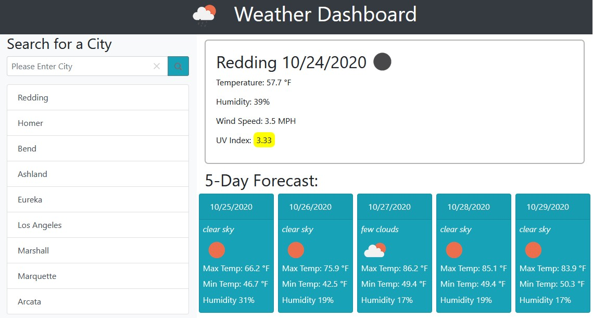

# Weather Dashboard Application
  

## Description

This Weather Dashboard Application is a landing page to search for and display current and 5-day forecast weather data for any city.

## Features

The Weather Dashboard utilizes the OpenWeather API which provides both free and paid for weather data for any location on the globe. This application uses two free API products, the [Current Weather Data](https://openweathermap.org/current) and [One Call](https://openweathermap.org/api/one-call-api) APIs. 

The search feature uses the Algolia places address search auto-completion API. This API uses OpenStreetMap's open source database of worldwide places to help auto-fill the search form for weather data. Once a city is searched for it is added to the list of ten most recent searches. If the city already exists in the list, it is removed from the current location and added to the top of the list. If the list already contains ten cities in the search history it will remove the oldest and add the newest to the top. These cities are saved in local storage of the browser and reloaded upon page load.

Once a city is searched, current weather is displayed in the main weather frame which shows City, date, temperature, humidity, wind speed, and UV index. The UV index is colorized based on value - from low to extreme. Below the current weather is the 5-day Forecast panels showing the data, general weather description, max temperature, minimum temperature, and humidity. There is also a weather icon which changes based on the general weather description and contains an alt value for accessibility standards. 

## Using the Application

The application can be used by visiting the live version on GitHub pages, or can be downloaded or clones from the GitHub repo [here](https://github.com/yooperjb/weather-dashboard). Please keep in mind that the application requires a private API key from both OpenWeather and Algolia and one must be created and used before use. The version shown on GitHub pages is not fully functional due to the key being blocked by GitHub. 

## Viewing the Weather Dashboard

Since the Weather Dashboard uses a personal API key, the application will not fully work on GitHub pages and must be cloned or downloaded from the repo and a private API key must be used. 

## Resources

Any third-party resource used in this application is listed here.

* [Bootstrap CSS](https://getbootstrap.com/)
* [OpenWeather API](https://openweathermap.org/api)
* [Algolia API](https://community.algolia.com/places/api-clients.html)
* [jQuery.js](https://jquery.com/)
* [Moment.js](https://momentjs.com/)